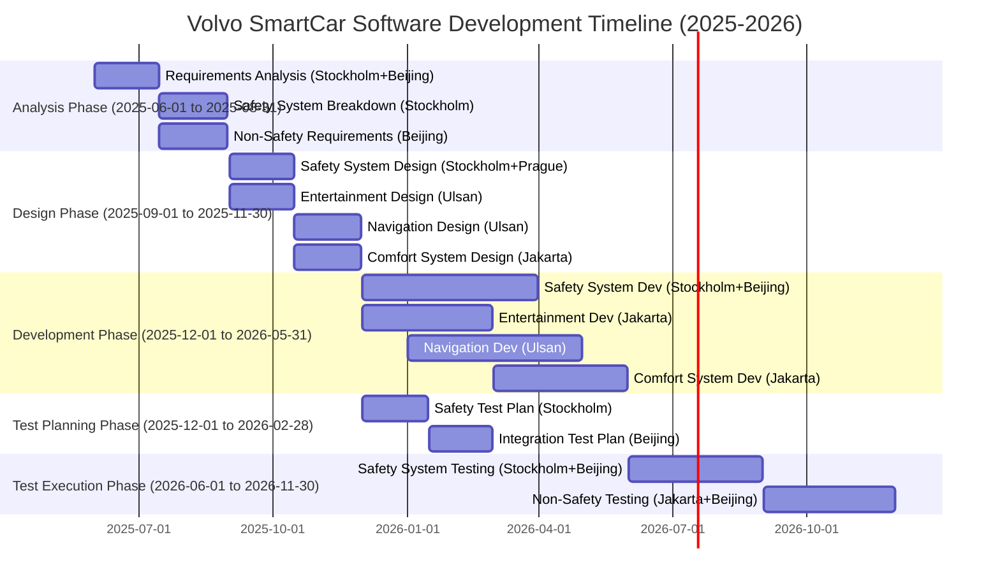

```mermaid
gantt
    title Volvo SmartCar Software Development Timeline (2025-2026)
    dateFormat  YYYY-MM-DD
    axisFormat %Y-%m-%d
    
    section Analysis Phase (2025-06-01 to 2025-08-31)
    Requirements Analysis (Stockholm+Beijing)          :a1, 2025-06-01, 2025-07-15
    Safety System Breakdown (Stockholm)               :a2, after a1, 2025-08-31
    Non-Safety Requirements (Beijing)                 :a3, after a1, 2025-08-31
    
    section Design Phase (2025-09-01 to 2025-11-30)
    Safety System Design (Stockholm+Prague)           :d1, 2025-09-01, 2025-10-15
    Entertainment Design (Ulsan)                     :d2, 2025-09-01, 2025-10-15
    Navigation Design (Ulsan)                        :d3, after d2, 2025-11-30
    Comfort System Design (Jakarta)                  :d4, after d2, 2025-11-30
    
    section Development Phase (2025-12-01 to 2026-05-31)
    Safety System Dev (Stockholm+Beijing)            :dev1, 2025-12-01, 2026-03-31
    Entertainment Dev (Jakarta)                     :dev2, 2025-12-01, 2026-02-28
    Navigation Dev (Ulsan)                          :dev3, 2026-01-01, 2026-04-30
    Comfort System Dev (Jakarta)                    :dev4, 2026-03-01, 2026-05-31
    
    section Test Planning Phase (2025-12-01 to 2026-02-28)
    Safety Test Plan (Stockholm)                    :tp1, 2025-12-01, 2026-01-15
    Integration Test Plan (Beijing)                 :tp2, 2026-01-16, 2026-02-28
    
    section Test Execution Phase (2026-06-01 to 2026-11-30)
    Safety System Testing (Stockholm+Beijing)       :test1, 2026-06-01, 2026-08-31
    Non-Safety Testing (Jakarta+Beijing)           :test2, 2026-09-01, 2026-11-30
```