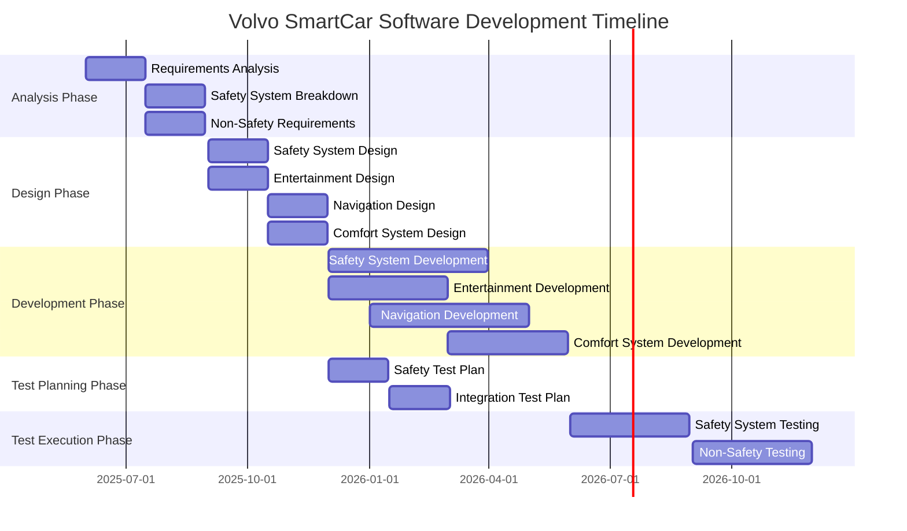

```mermaid
gantt
    title Volvo SmartCar Software Development Timeline
    dateFormat  YYYY-MM-DD
    
    section Analysis Phase
    Requirements Analysis         :a1, 2025-06-01, 45d
    Safety System Breakdown       :after a1, 45d
    Non-Safety Requirements       :after a1, 45d
    
    section Design Phase
    Safety System Design          :d1, 2025-09-01, 45d
    Entertainment Design         :d2, 2025-09-01, 45d
    Navigation Design            :after d2, 45d
    Comfort System Design        :after d2, 45d
    
    section Development Phase
    Safety System Development    :dev1, 2025-12-01, 120d
    Entertainment Development    :dev2, 2025-12-01, 90d
    Navigation Development       :dev3, 2026-01-01, 120d
    Comfort System Development   :dev4, 2026-03-01, 90d
    
    section Test Planning Phase
    Safety Test Plan             :tp1, 2025-12-01, 45d
    Integration Test Plan        :tp2, 2026-01-16, 45d
    
    section Test Execution Phase
    Safety System Testing        :test1, 2026-06-01, 90d
    Non-Safety Testing           :test2, 2026-09-01, 90d
```